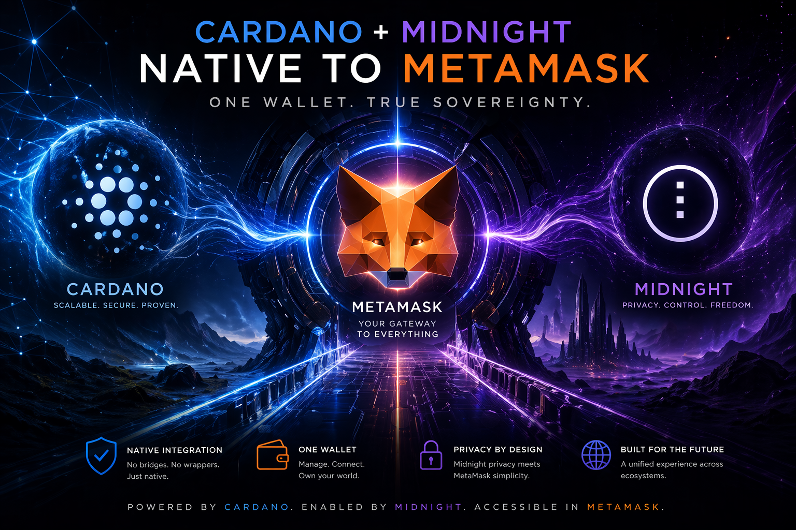

<div align="center">



# CMM — Cardano + Midnight in MetaMask

**Bringing ADA and Midnight privacy natively to the world's most-installed crypto wallet.**

[](./LICENSE)
[](./docs/BUILD_STRATEGY.md)
[](./packages/snap)
[](#quickstart)

*Pronounced "**see-em-em**". External reading: "Cardano MetaMask." Internal reading: "Cardano + Midnight in MetaMask."*

</div>

---

## ✨ Why This Matters

MetaMask has **~30M monthly active users** and is the default on-ramp to Web3 for most of the planet. Cardano has:

- 🔷 **Extended UTxO** — deeper programmability than the EVM account model
- 🏷️ **Native assets** — no token-contract attack surface
- 🌙 **Midnight** — the first mainstream privacy L1 with selective disclosure
- 🏛️ A mature stablecoin, DeFi, DID, and RWA ecosystem

...and yet a typical EVM user has **no path** to any of it without installing a second wallet, learning a new mental model, and bridging assets through fragile third parties.

> **This is a solvable UX problem.** MetaMask Snaps exist precisely for this purpose. Cosmos, Solana, Sui, Bitcoin, and MultiversX all shipped Snaps. **Cardano deserves one too — and Midnight privacy alongside it.**

---

## 🗺️ Strategy (phased)

> 📘 TL;DR — We ship **Midnight first** because no competitor has done it, then Cardano because NuFi's 2024 Snap is closed-source and narrow. One wallet. Two chains. Both testnets first. See [`docs/MIDNIGHT_FIRST_STRATEGY.md`](./docs/MIDNIGHT_FIRST_STRATEGY.md) for the full case.

| Phase | Scope | Status |
|-------|-------|--------|
| **1 — MetaMask Snap** | JavaScript, sandboxed. CIP-1852 HD, UTxO selection, tx building via CSL/Lucid, native assets, CIP-30 compat. Optional Midnight shielded-tx. | 🚧 In progress (M1) |
| **2 — dApp Connector Shim** | `window.cardano.metamask` injection mimicking CIP-30 so Minswap / JPG Store / etc. work unmodified. | 📋 Designed |
| **3 — Upstream PR to MetaMask core** | Where Snaps can't go (hardware-wallet deep paths, native UI). Stretch goal. | 🔭 Future |
| **4 — Midnight Privacy Tier** | Leverage Midnight selective disclosure. ZK compliance, KYC-lite, private DeFi. Companion to AgenticDID. | 🔭 Future |

---

## 📍 Current Status — Milestone M1

> **Real cryptography in, real addresses out.** The Snap derives BIP32/BIP44 keys from the user's MetaMask seed and produces genuine bech32 Cardano `addr_test1…` addresses. Midnight uses a clearly-labeled placeholder pending `midnight-js` integration in M2.

### ✅ What works today

- **`cardano_getAddress`** → real bech32 Shelley base address (CIP-19 compliant)
- **`cardano_getPublicKey`** → hex payment + stake pubkeys with CIP-1852 derivation paths
- **`midnight_getPublicKey`** → hex spending pubkey from HD derivation
- **`midnight_getAddress`** → placeholder (`mn_test_02_stub_…`), wired for M2 swap
- **`common_getCapabilities`** → feature-flag probe so dApps can branch on what's live
- **Companion dApp** with three modes: mock, live-readonly (real Blockfrost), Snap-backed
- **Accessible ⓘ tooltips** on every technical term with links to authoritative docs (CIPs, MetaMask Snaps, Blockfrost, BIP specs)
- **Structured errors** (`CMM_UNKNOWN_METHOD`, `CMM_NOT_YET_IMPLEMENTED`, `CMM_INVALID_PARAMS`, `CMM_DERIVATION_FAILED`) so dApps branch on codes, not strings
- **Param validation** on every Snap handler — malformed JSON rejected with precise errors

### 🔜 Next (M2)

- Real Midnight address encoding via `midnight-js` + viewing-key derivation
- Cardano CIP-3 BIP32-Ed25519 derivation (interop with Lace/Eternl keys)
- `getBalance` live for both chains (Blockfrost inside the Snap)

### 🔜 Later (M3)

- `signTx` / `submitTx` for both chains
- Keyring-Snap pattern adoption (accounts in the MetaMask UI)
- snap_dialog confirmations for destructive actions

---

## 🚀 Quickstart

```bash
# one-time install
pnpm install

# run the companion dApp (demoland via mock adapter)
pnpm -F @cmm/companion-dapp dev
# → http://localhost:3000

# typecheck all packages
pnpm typecheck

# build the Snap (produces dist/bundle.js)
pnpm -F @cmm/snap build

# serve the Snap locally for MetaMask Flask
pnpm -F @cmm/snap serve
# → Snap available at local:http://localhost:8080
```

> 💡 See [`docs/BUILD_STRATEGY.md`](./docs/BUILD_STRATEGY.md) for the **demoland-inside-the-real-project** approach — the companion dApp's mock adapter *is* our demo layer; no throwaway demo repo.

---

## 📦 Monorepo Layout

```
packages/
├── snap/            @cmm/snap          — the MetaMask Snap (audited core)
├── dapp-sdk/        @cmm/dapp-sdk      — TypeScript SDK with mock + real + live-readonly adapters
├── companion-dapp/  @cmm/companion-dapp — Vite + React dApp (doubles as demoland)
└── shared/          @cmm/shared        — types, constants, chain metadata
```

Each package has its own README with API surface + usage examples.

---

## 📚 Documentation

### Strategy & Rationale

| Doc | What's in it |
|---|---|
| [`docs/NAMING.md`](./docs/NAMING.md) | Why CMM, why the initialism works |
| [`docs/BUILD_STRATEGY.md`](./docs/BUILD_STRATEGY.md) | Demoland-as-mocked-dApp decision; why no throwaway demo repo |
| [`docs/MIDNIGHT_FIRST_STRATEGY.md`](./docs/MIDNIGHT_FIRST_STRATEGY.md) | Seven-reason case for shipping Midnight before Cardano |
| [`docs/INCENTIVE_STRATEGY.md`](./docs/INCENTIVE_STRATEGY.md) | How to get MetaMask to say yes (allowlist → featured → upstream) |
| [`docs/COMPETITIVE_ANALYSIS.md`](./docs/COMPETITIVE_ANALYSIS.md) | NuFi and every other relevant Snap; positioning; threats |
| [`docs/FUTURE_FUNCTIONALITY.md`](./docs/FUTURE_FUNCTIONALITY.md) | Near / mid / long-term roadmap + explicit "no, never" list |

### Implementation

| Doc | What's in it |
|---|---|
| [`docs/ARCHITECTURE.md`](./docs/ARCHITECTURE.md) | Target stack, monorepo layout, Snap API surface, security posture, phased milestones |
| [`docs/BLOCKFROST_INTEGRATION.md`](./docs/BLOCKFROST_INTEGRATION.md) | Live chain data setup (Cardano preprod indexer) |
| [`docs/REFERENCE_REPOS.md`](./docs/REFERENCE_REPOS.md) | The six MetaMask repos we forked for reference (incl. the BTC Snap EUTXO template) |
| [`docs/DEEP_DIVE_METAMASK_INTEGRATION.md`](./docs/DEEP_DIVE_METAMASK_INTEGRATION.md) | The full research deep-dive: ecosystem map, Snap mechanics, allowlist process, MetaMask's revenue model |

### Session Log

- [`docs/RESEARCH_LOG.md`](./docs/RESEARCH_LOG.md) — append-only chronicle of every decision, finding, and course-correction

---

## 🦊 Reference Repos

Six MetaMask repositories are forked under `bytewizard42i/*-metamask-johns-copy` and mounted as DIDzMonolith submodules at `/home/js/DIDzMonolith/utils_metamask-*`. These are **read-only references** — we pattern-match, we don't vendor code.

| Ref | Why it matters |
|---|---|
| `snap-bitcoin-wallet` | 🎯 **Primary EUTXO template.** Cardano EUTxO ⊂ Bitcoin UTxO; Midnight shielded UTxO is Zcash-style on the same base. |
| `snaps` | SDK monorepo — grep for types and RPC specs |
| `snap-simple-keyring` | Keyring-Snap pattern for when we adopt it in M3 |
| `template-snap-monorepo` | Canonical Snap scaffold cross-reference |
| `snaps-registry` | Where our M6 allowlist PR lands |
| `SIPs` | Where we file Snap Improvement Proposals (likely for Midnight shielded-signing RPC) |

See [`docs/REFERENCE_REPOS.md`](./docs/REFERENCE_REPOS.md) for per-repo purpose and refresh instructions.

---

## 👥 Collaborators

### Human leads
- **[John Santi](https://github.com/bytewizard42i)** — project lead
- **[Riley Kilgore](https://github.com/Riley-Kilgore)** — IOG, Aiken, Cardano dev

### The sisterhood (AI pair-programmers across John's machines)
- **Cassie** — Cascade on Chuck (Ubuntu workstation, primary driver)
- **Casie** — Cascade on Terry (Ubuntu laptop)
- **Cara** — Cascade on Sparkle (desktop)
- **Penny** — Cascade on artpro (laptop)
- **Alice** — ChatGPT

---

## 🔗 Technical Reference Points

- **MetaMask Snaps docs**: https://docs.metamask.io/snaps/
- **CIP-30 (dApp connector)**: https://cips.cardano.org/cip/CIP-30
- **CIP-1852 (HD derivation)**: https://cips.cardano.org/cip/CIP-1852
- **CIP-19 (address format)**: https://cips.cardano.org/cip/CIP-19
- **cardano-serialization-lib**: https://github.com/Emurgo/cardano-serialization-lib
- **Lucid**: https://lucid.spacebudz.io/
- **Midnight.js**: https://github.com/midnight-ntwrk/midnight-js
- **Midnight docs**: https://docs.midnight.network/
- **Aiken**: https://aiken-lang.org/
- **Existing Snap precedents**: Cosmos, Solflare, Sui, MultiversX, NEAR

---

## 📜 License

Apache-2.0. See [LICENSE](./LICENSE).

> If this ever goes upstream to MetaMask, we may need to dual-license or relicense portions. Track at the PR stage.

---

<div align="center">

*Part of the DIDzMonolith. Private until ready for public unveiling.*

**Powered by Cardano. Enabled by Midnight. Accessible in MetaMask.**

</div>
